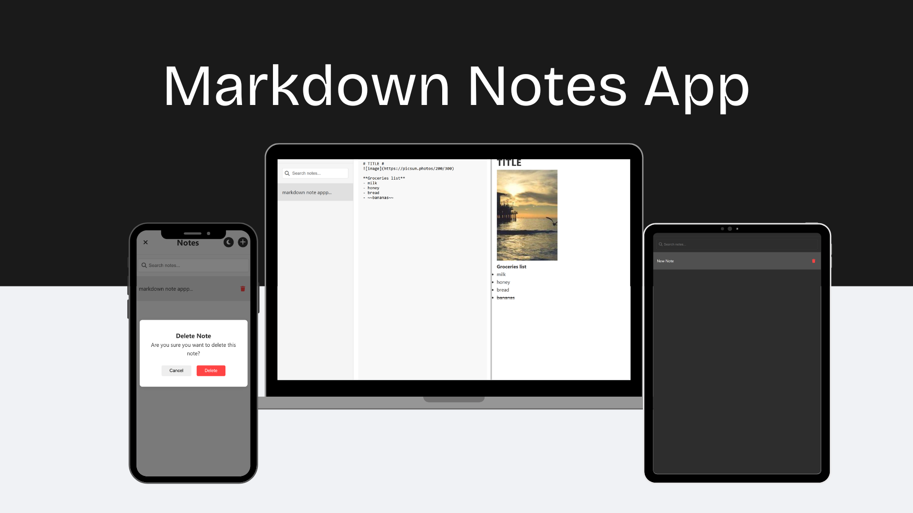
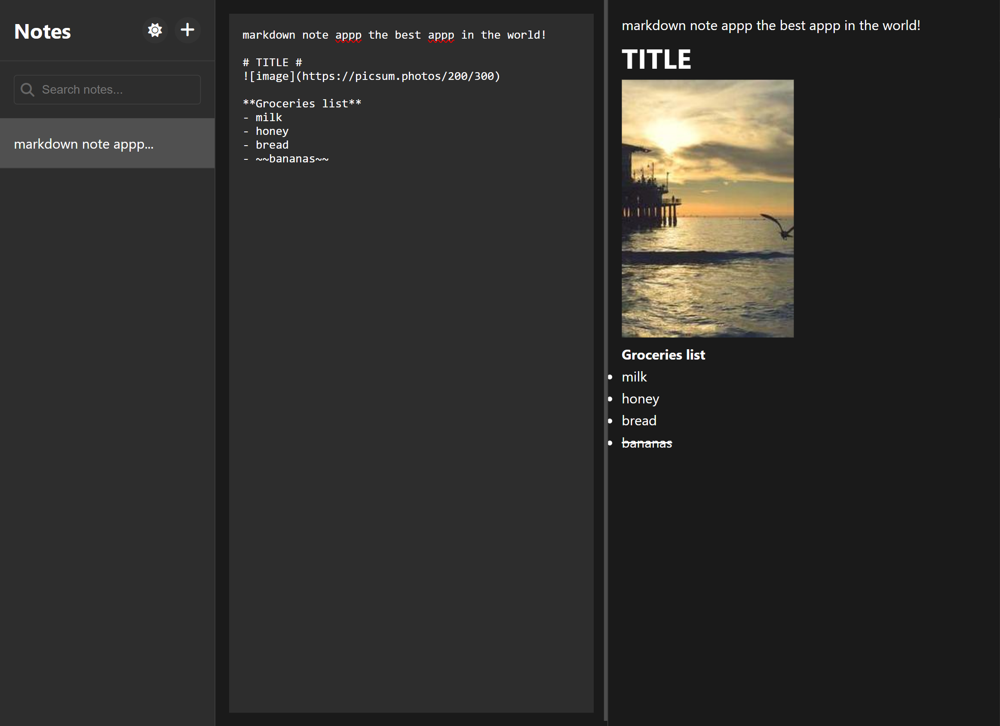
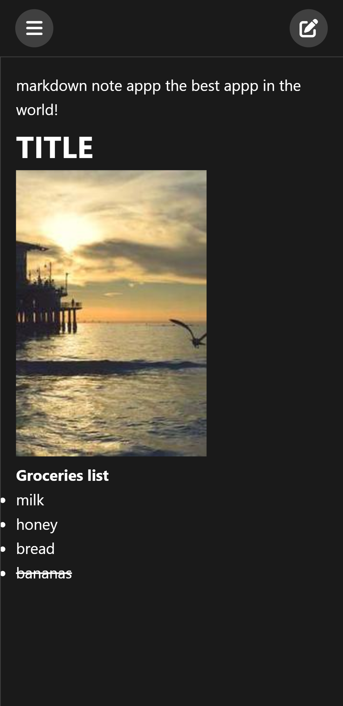

# Markdown Notes App

A minimalist browser-based Markdown notes application that allows you to create, edit, and manage notes with Markdown support. The app features a clean interface, real-time Markdown preview, and dark/light mode support.



## Features

- 📝 Create and manage notes with Markdown support
- 👁️ Real-time Markdown preview
- 🌓 Dark/Light mode toggle
- 📱 Fully responsive design (mobile, tablet, and desktop)
- 🔍 Search functionality
- 💾 Automatic saving to localStorage
- ⌨️ Clean, minimalist interface

## Technologies Used

- HTML5
- CSS3
- Vanilla JavaScript
- [Marked.js](https://marked.js.org/) for Markdown parsing
- [Font Awesome](https://fontawesome.com/) for icons
- LocalStorage for data persistence

## Usage

### Creating Notes
- Click the '+' button to create a new note
- Start typing in the editor
- Notes are automatically saved

### Editing Notes
- Select any note from the sidebar to edit
- Use Markdown syntax for formatting
- See real-time preview (desktop) or toggle preview mode (mobile/tablet)

### Deleting Notes
- Hover over a note in the sidebar
- Click the trash icon to delete
- Confirm deletion in the popup

### Search
- Use the search bar to filter notes
- Searches both titles and content

### Theme Toggle
- Click the moon/sun icon to switch between dark and light modes
- Theme preference is saved automatically

## Markdown Support

The app supports standard Markdown syntax including:
- Headers (#, ##, ###)
- Bold (**text**)
- Italic (*text*)
- Lists
- Links
- Code blocks
- And more!

## Desktop view


## Mobile Features

On mobile devices, the app provides:
- Slide-out sidebar for note management
- Toggle between edit and preview modes
- Full-screen editing experience
- Touch-friendly interface

## Mobile view



## Installation

1. Clone the repository:
```bash
git clone https://github.com/siboraberishaa/markdown-project.git
```

2. Open `index.html` in your browser

Or simply host the files on any web server.

## Browser Support

- Chrome (recommended)
- Firefox
- Safari
- Edge

## Local Storage

The app uses browser's localStorage to save:
- Notes content and metadata
- Theme preference
- Current note selection

Note: Clear browser data will delete all saved notes.

## Contributing

Feel free to submit issues and enhancement requests!

## License

This project is licensed under the MIT License